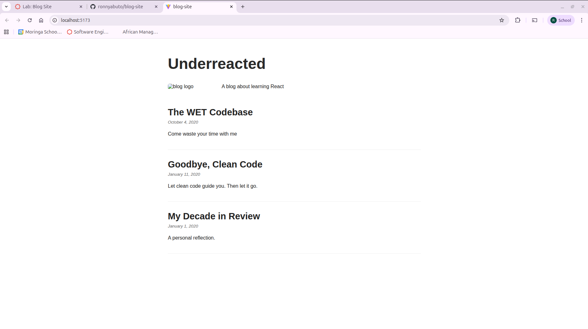

# Blog Site

A personal blog built with React.

## Instructions

### Install Dependencies
Run the following command to install the required packages:
```bash
npm install
```

### Run the Application
Start the development server:
```bash
npm run dev
```
Open [http://localhost:5173](http://localhost:5173) in your browser.

### Run Tests
Execute the test suite:
```bash
npm test
```

## Features

- **Header**: Displays the blog name.
- **About**: Shows the blog logo and description.
- **ArticleList**: Lists all blog posts dynamically.
- **Article**: Displays individual post details.


